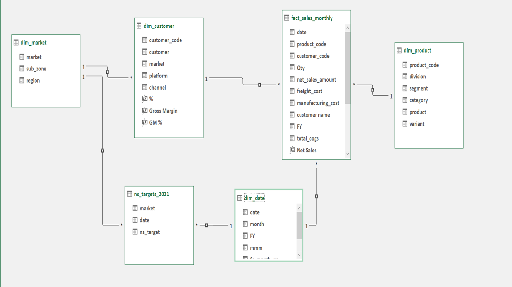

# 📊 AtliQ Hardware — Sales & Finance Analytics (Excel BI Project)

An end-to-end **Sales & Finance Analytics** solution built entirely in **Microsoft Excel**, leveraging **Power Query**, **Power Pivot**, and **DAX** to transform **500,000+** raw sales transactions into interactive, decision-ready business reports.


---

# 📌 Project Overview

**AtliQ Hardware** is a fictional computer hardware manufacturer that sells PCs, printers, and peripherals through retail and e-commerce partners such as **Amazon, Walmart, Croma, and Flipkart** across more than **20 countries**.

The objective of this project was to build a scalable, self-service reporting solution that enables stakeholders to monitor sales, finance, profitability, and market performance using only Microsoft Excel.

---

# 🎯 Business Objectives

The reporting solution helps answer key business questions such as:

- Which customers generate the highest revenue?
- Which markets are driving growth?
- Are sales targets being achieved?
- Which products are performing best?
- How is profitability changing over time?

The dashboards cover:

- ✅ Customer Performance
- ✅ Product Performance
- ✅ Market Performance vs Target
- ✅ Division-Level Sales
- ✅ Profit & Loss Reporting
- ✅ Gross Margin Analysis

---

# 🗂️ Data Model (Star Schema)

A **star-schema** data model was created in **Power Pivot**.

### Fact Table

- **fact_sales_monthly**

### Dimension Tables

- **dim_customer**
- **dim_product**
- **dim_market**
- **dim_date**

### Supporting Table

- **ns_targets_2021** (Sales Targets)

### ERD



Relationships are one-to-many from each dimension table into the central fact table, enabling fast filtering across customers, products, markets, and fiscal periods.

---

# 🔄 ETL Process (Power Query)

The ETL pipeline included:

- Importing raw CSV files
- Removing duplicates
- Handling missing values
- Correcting data types
- Cleaning inconsistent records
- Building a custom fiscal calendar (September–August)
- Merging lookup tables
- Preparing data for Power Pivot

---

# 📐 Data Modeling & DAX

Reusable DAX measures were created for consistent reporting.

```DAX
Net Sales =
net_sales_amount - freight_cost

COGS =
manufacturing_cost + freight_cost + other_costs

Gross Margin =
[Net Sales] - [COGS]

GM % =
DIVIDE([Gross Margin],[Net Sales])

YoY Growth % =
DIVIDE([Current Year]-[Previous Year],[Previous Year])
```

---

# 📊 Reports Delivered

| Report | Description |
|---------|-------------|
| Customer Performance | Net Sales by customer with YoY growth |
| Market Performance vs Target | Actual vs Target Sales |
| P&L by Fiscal Year | Revenue, COGS, GM & GM% |
| P&L by Quarter | Quarterly financial performance |
| P&L by Market | Country-wise profitability |
| P&L by Sub-zone | Regional profitability |
| Division Performance | Sales by business division |
| Top / Bottom Products | Product ranking by quantity sold |
| Top 5 Countries | Highest revenue countries |
| New Product Performance | Analysis of 2021 product launches |

---

# 📈 Key Business Insights

### 🚀 Revenue Growth

- FY19 → **$87.5M**
- FY20 → **$196.7M**
- FY21 → **$598.9M**

📈 **204.5% YoY growth in FY21**

---

### 📉 Margin Compression

Gross Margin declined from

- **41.4% (FY19)**
- **36.4% (FY21)**

showing costs increased faster than revenue.

---

### 🌍 Top Revenue Markets

| Country | Net Sales |
|----------|-----------|
| India | $161.3M |
| USA | $87.8M |
| South Korea | $49.0M |

Together they contributed almost **50% of global revenue.**

---

### 🎯 Sales Target Performance

Despite rapid growth,

- Actual FY21 Sales missed target by

**8.4% ($54.9M)**

Largest gaps:

- Poland (-15.3%)
- Canada (-12.6%)

---

### 💻 Division Performance

| Division | YoY Growth |
|------------|-----------|
| PC | 313.7% |
| Peripherals & Accessories | 221.5% |
| Networking & Storage | 84.4% |

---

### 🛒 Top Customers

| Customer | FY21 Sales |
|-----------|------------|
| Amazon | $82.1M |
| AtliQ Exclusive | $61.1M |
| AtliQ e Store | $53.0M |

---

### 🆕 New Product Success

2021 launches generated

**$176.2M**

Top performers:

- AQ Qwerty — $22.0M
- AQ Trigger — $20.7M

---

# 🛠️ Tools & Technologies

- Microsoft Excel
- Power Query
- Power Pivot
- DAX
- Pivot Tables
- Pivot Charts
- XLOOKUP
- INDEX-MATCH
- SUMIFS
- IF Functions

---

# 📁 Repository Structure

```text
├── reports/
│   ├── Customer_Performance_Report.pdf
│   ├── Market_Performance_Vs_Target_Report.pdf
│   ├── P_L_Statement_By_Fiscal_Year.pdf
│   ├── P_L_Statement_By_Market.pdf
│   ├── P_L_Statement_By_Quarters.pdf
│   ├── P_L_Statement_By_Sub_Zone.pdf
│   ├── Products_Based_on_Division_Level.pdf
│   ├── Top_5___Bottom_5_Products.pdf
│   ├── Top_5_Country-2021.pdf
│   ├── Top_10_Products.pdf
│   ├── New_Product-2021.pdf
│   └── Whole_Report.pdf
│
├── assets/
│   └── ERD_diagram1.png
│
└── README.md
```

---

# 🙏 Acknowledgements

Special thanks to the **Codebasics** team, especially **Dhaval Patel** and **Hemanand Vadivel**, for providing industry-focused learning and guidance throughout this project.

---

# 📬 Connect With Me

If you have any feedback, suggestions, or would like to discuss this project, feel free to connect.

⭐ If you found this project helpful, consider giving the repository a **Star**.

---

**Tags**

`Excel` `Power Query` `Power Pivot` `DAX` `Business Intelligence` `Data Analytics` `Sales Analytics` `Finance Analytics` `Dashboard` `Portfolio Project`
